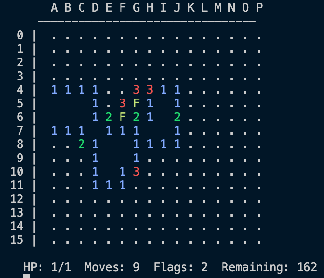

# MORTAR Minesweeper

This repository adapts the [MORTAR](https://arxiv.org/pdf/2601.00105) quality-diversity and LLM-guided system to Minesweeper, in order generate novel and interesting game mechanics.



## Playing the game

### Human

To play as a human, from the mortar-minesweeper directory run
```
python main.py       
```

To play with a particular mechanic, run
```
python main.py --mechanic extra-life
```

Use the following commands to play the game

| Action | Command | Example |
|---|---|---|
| Reveal a cell | `r <row> <col>` | r 7 D |
| Flag a cell | `f <row> <col>` | f 2 J |
| Show all commands | `h` | |
| Quit | `q` | |

### Agent
| Command | Outcome |
|---|---|
| Single, headless game | `python main.py --agent random` |
| To see board outcome | `python main.py --agent random --watch` |
| To batch the summary across a set of games | `python main.py --agent random --games 100` |
| Reproducable run with a seed | `python main.py --agent random --seed 42` |
| With a mechanic enabled | `python main.py --agent random --mechanic extra-life` |


## Setup
- Uses pure python stdlib, no dependencies to install
- Python 3.10+ required
